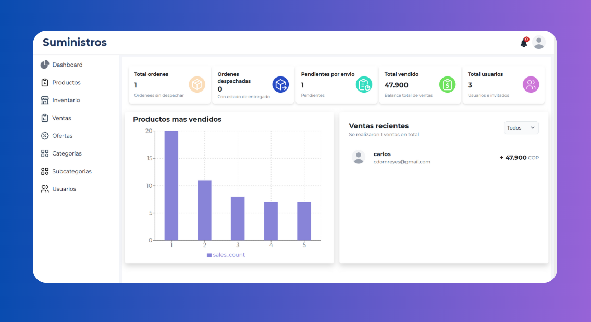

# Panel de administracion para Tienda Web - Suministros

<a href="https://dashboard-administrador.vercel.app/auth">



</a>

Este es un proyecto es desarrollado con Astro y react, permite a uno o varios administradores gestionar su sitema, teniedo la posiblidad de visualizar y adminstrar partes del mismo sistema.

## Índice

- [Características](#características)
- [Tecnologías](#tecnologías)
- [Requisitos Previos](#requisitos-previos)
- [Instalación](#instalación)
- [Configuración](#configuración)
- [Estructura del Proyecto](#estructura-del-proyecto)
- [Licencia](#licencia)

## Características

- _Analitica de productos mas vendidos_: Grafica que permite visulizar los productos mas vendidos.
- _Gestion de productos_: Seccion para el manejo de producto, agregar - editar - elimniar y guardar.
- _Administracion de inventario_: Permite al administrador gestionar el invenatario, eliminar - actulizar - editar propductos del invenatrio.
- _Adminstracion de ventas_: Permite visulizar el listado de compras realizadas, ademas de gestionar los estados de las mismas, en alistamiento - en camino - entregado.
- _Gestion de categrias / subcategorias_: Permite gestionar categorias y subcategorias para los productos: Agregar - eliminar y listar.
- _Gestion de ofertas_: Permite al administrador crear - editar y elimar ofertas para los usuarios.
- _Interfaz amigable_: Desarrollada con Astro y Tailwind CSS para una experiencia de usuario óptima en dispositivos móviles y de escritorio.

## Tecnologías

- _Frontend_: [Astro](https://astro.build/) con componentes React y Tailwind CSS.
- _gestor de imagenes_: [cloudinary](https://cloudinary.com/) para la guaradar imagenes

## Requisitos Previos

Antes de comenzar, asegúrate de tener instalado lo siguiente:

- [Astro](https://astro.build/) (para ejecutar el proyecto)
- [Node.js](https://nodejs.org/) (versión 14 o superior)
- Cuenta de [cludinary](https://cloudinary.com/)

## Instalación

1. Bifucar o Clonar el repositorio\*:

- bash: git clone https://github.com/cdomdev/Dashboard-administrador

2. Instalar las dependencias:

Usamos npm para instalar y administrar las dependencias.

# Instala node para Windows:

- powershell -c https://nodejs.org/dist/v20.18.0/node-v20.18.0-x64.msi | bash

# Instalacion con npm:

- npm install

## Configuracion

1. _Configurar el entorno_:

Crea un archivo .env en la raiz del proyecto y añade las siguientes varibles con tus claves de acceso

Cliente de cloudinary para el almacenamiento de imagenes - lo solicitas atrevez de: https://cloudinary.com/users/login

```text
PUBLIC_CLOUDNAME='dd7gtmrax'
```

Nombre que te proporciona cloudinary

```text
PUBLIC_CLOUDNAME='nombre de folder paralas imagenes en cloudinary'
```

Preset para la carga de segura de tus imagenes

```text
PUBLIC_UPLOAD_PRESET='el preset persanal que te proporciona cludinary'
```

Nombre del folder donde se guardan tus imagenes, ejemplo productos etc

```text
PUBLIC_FOLDER='nombre de tu folder, debe se definio en cludinary'
```

## Estructura del Proyecto

```text
/
├── public/
│   └── favicon.webp
├── src/
│   ├── components /
│   │   └── Inventario/
│   │       └── Inventario.jsx
│   ├── config/
│   │   └── Config.ts
│   │   └── axios.conf.ts
│   ├── layouts/
│   │   └── layout.astro
│   ├── pages/
│   │   └── dashboard.astro
│   └── services/
│       └── balances.ts
└── .astro.c
├── .gitignore
└── .env
└── package.json
└── README.md

```

## Licencia

Este proyecto está bajo la Licencia MIT - Para mas detalles ver el archivo LICENSE.
